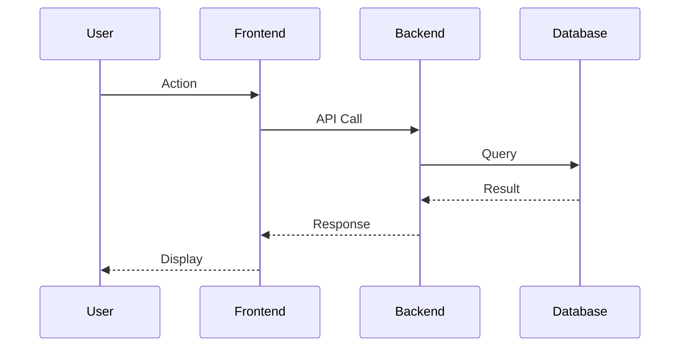

# User Flow Mapper

Documenta flujos de usuario completos incluyendo happy path, alternativas y excepciones.

## Instrucciones

1. **Identifica actores** — ¿Quién interactúa con el sistema?
2. **Define precondiciones** — ¿Qué debe existir antes?
3. **Mapea happy path** — Flujo principal exitoso
4. **Identifica alternativas** — Otros caminos válidos
5. **Documenta excepciones** — Errores y cómo manejarlos

## Output Format

```markdown
## User Flow: [Flow Name]

### Overview
[Descripción del flujo y su objetivo de negocio]

### Actors
| Actor | Description | Permissions |
|-------|-------------|-------------|
| Primary User | ... | ... |
| System | ... | ... |
| External Service | ... | ... |

### Preconditions
- [ ] User is authenticated
- [ ] Required data exists
- [ ] External services available

### Postconditions (Success)
- [ ] State changed to X
- [ ] Notification sent
- [ ] Audit log created

---

## Main Flow (Happy Path)

| Step | Actor | Action | System Response | Data |
|------|-------|--------|-----------------|------|
| 1 | User | Opens page | Shows form | - |
| 2 | User | Fills form | Validates input | form_data |
| 3 | User | Submits | Processes request | - |
| 4 | System | - | Shows confirmation | result |

### Sequence Diagram


---

## Alternative Flows

### Alt-1: [Condition]
**Trigger:** When [condition] occurs at step [X]

| Step | Action | Response |
|------|--------|----------|
| X.1 | ... | ... |

**Resumes at:** Step [Y] of main flow

---

## Exception Flows

### Exc-1: [Error Type]
**Trigger:** When [error] occurs

| Step | System Action | User Feedback |
|------|---------------|---------------|
| E.1 | Log error | Show message |
| E.2 | Rollback | Offer retry |

**Recovery:** [How to recover]

---

## Edge Cases

| Case | Input | Expected Behavior | Priority |
|------|-------|-------------------|----------|
| Empty input | "" | Show validation error | P1 |
| Max length | 1000+ chars | Truncate or reject | P2 |
| Special chars | <script> | Sanitize | P0 |
| Concurrent access | 2 users same record | Lock or merge | P1 |

---

## Test Coverage Mapping

| Flow | Test ID | Type | Automated |
|------|---------|------|-----------|
| Happy Path | E2E-001 | E2E | Yes |
| Alt-1 | E2E-002 | E2E | Yes |
| Exc-1 | INT-001 | Integration | Yes |
```

## Consideraciones

- Piensa en todos los tipos de usuario
- Considera estados del sistema (online/offline, cargado/vacío)
- Mapea integraciones con servicios externos
- Identifica puntos de fallo críticos
